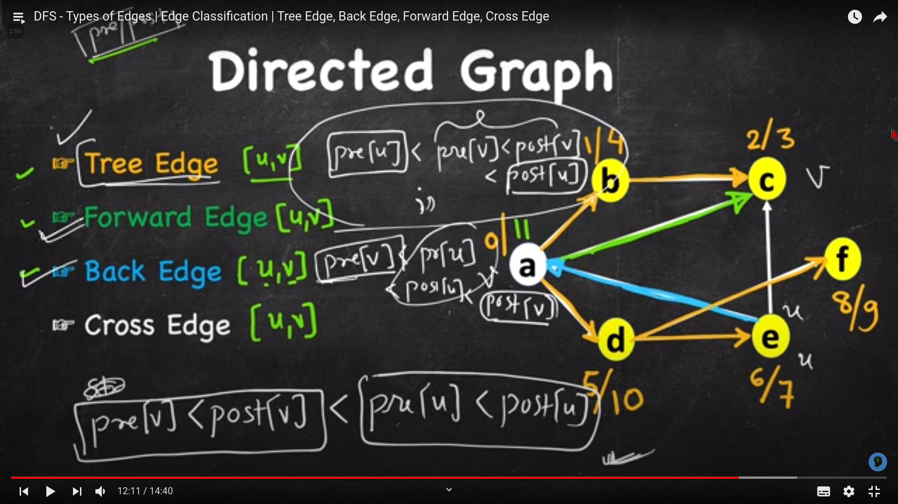

1.  Running DFS on a connected component of a graph forms a DFS spanning tree 1 (or spanning forest if the graph has more than one component and DFS is run per component)

1.  **Graph Edges** - in directed graph: 
    1.  **Tree edges**: DFS_GRAY to vertex with DFS_WHITE.
    2.  **Back edges**: DFS_GRAY to vertex with DFS_GRAY
        1.  if parent[u]==v -> bidirectional edge
        2.  else backedge
    3.  **Forward/Cross edge**: DFS_GRAY to vertex with DFS_BLACK

1.  IN undirected graph there is only two types of edges:
    1.  Tree
    2.  BackEdge

1.  Every graph with n nodes and k connected components have atleast n-k edges
so if a graph at most k connected components the answer is m-n+k

```
void graphCheck(int u) {    // DFS for checking graph edge properties
    dfs_num[u] = DFS_GRAY;  // color this as DFS_GRAY (temp) instead of DFS_BLACK
    for (int j = 0; j < (int)AdjList[u].size(); j++) {
        ii v = AdjList[u][j];
            if (dfs_num[v->first] == DFS_WHITE) {   // Tree Edge, DFS_GRAY to DFS_WHITE
            dfs_parent[v->first] = u;   // parent of this children is me
            graphCheck(v->first);
        }
        else if (dfs_num[v->first] == DFS_GRAY) {   // DFS_GRAY to DFS_GRAY
            if (v->first == dfs_parent[u])  // to differentiate these two cases
            printf(" Bidirectional (%d, %d)-(%d, %d)\n", u, v->first, v->first, u);
            else // the most frequent application: check if the given graph is cyclic
            printf(" Back Edge (%d, %d) (Cycle)\n", u, v->first);
        }
        else if (dfs_num[v->first] == DFS_BLACK)    // DFS_GRAY to DFS_BLACK
            printf("Forward/Cross Edge (%d, %d)\n", u, v->first);
    }
    dfs_num[u] = DFS_BLACK; // after recursion, color this as DFS_BLACK (DONE)
}
```




